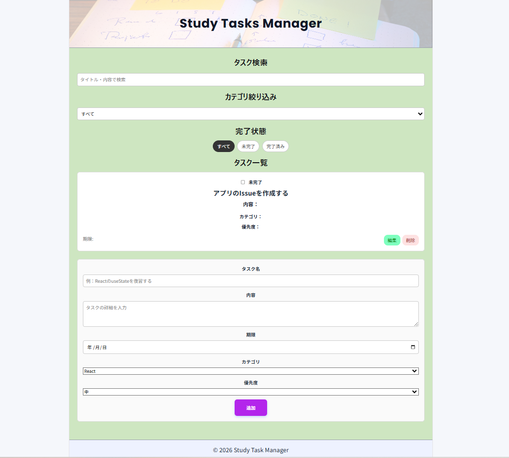
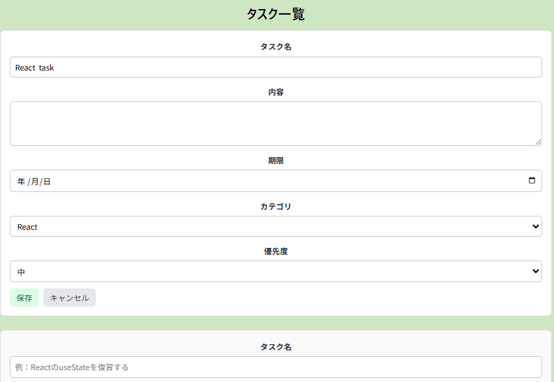
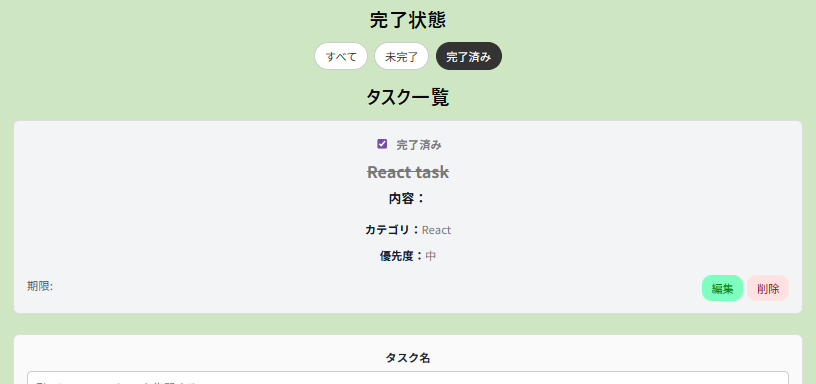

# Study Task Manager

学習タスクを管理するための React + TypeScript 製タスク管理アプリ。

タスクの追加・編集・削除・完了状態の切り替えに加えて、カテゴリ・優先度・検索・絞り込み機能を実装している。

---

## 概要

Study Task Manager は、日々の学習タスクを整理し、進捗を管理するためのシングルページアプリケーション。

React の基礎である state 管理、props によるデータ受け渡し、フォーム制御、条件分岐表示、配列操作、コンポーネント分割などを学んだ後で、実際にアプリを作ってアウトプットするという目的で作成した。

---
## デプロイURL

以下のURLからアプリを確認できます。

 https://study-task-manager-roan.vercel.app/

---

## スクリーンショット

### アプリ全体



### タスク編集



### タスク絞り込み



--- 
## 作成目的

このアプリは、React を用いたフロントエンド開発の基礎力を身につけることを目的として作成。

特に、長期インターン応募時に以下の力を示せるように意識している。

- React + TypeScript による基本的なアプリ開発
- useState を用いた状態管理
- フォーム入力の制御
- タスク一覧の表示・追加・編集・削除
- 検索・絞り込み機能の実装
- LocalStorage を用いたデータ永続化
- コンポーネント分割による保守性の向上
- GitHub Issue / ブランチ / PR を意識した開発管理

---

## 主な機能

### タスク管理

- タスクの追加
- タスクの編集
- タスクの削除
- 完了状態の切り替え
- 完了済みタスクの視覚的な区別

### タスク情報

- タイトル
- 内容
- 期限
- カテゴリ
- 優先度
- 完了状態

### 検索・絞り込み

- キーワードによる検索
- カテゴリによる絞り込み
- 完了状態による絞り込み

### データ保存

- LocalStorage によるタスクデータの保存
- リロード後もタスク情報を保持

---

## 使用技術

| 分類 | 技術 |
|---|---|
| フロントエンド | React |
| 言語 | TypeScript |
| ビルドツール | Vite |
| スタイリング | CSS |
| データ保存 | LocalStorage |
| デプロイ | Vercel |
| バージョン管理 | Git / GitHub |

---

## ディレクトリ構成

```text
src/
├── dist/
├── components/
│   ├── layout/
│   │   ├── Header/
│   │   ├── MainContent/
│   │   └── Footer/
│   │
│   │── ui/
│   │   └── EmptyState/
│   │
│   └── tasks/
│       ├── TaskForm/
│       │── TaskEditForm/
│       ├── TaskList/
│       ├── TaskItem/
│       ├── TaskSearch/
│       │
│       └── TaskFilter/
│           ├──TaskCategoryFilter
│           └──TaskCompletionFilter
│
├── data/
│   └── initialTasks.ts
│
├── types/
│   └── task.ts
│
├── utils/
│   └── localStorage.ts
│
├── App.css
├── App.tsx
├── main.tsx
└── index.css

```

---

## セットアップ方法

1. リポジトリをクローン
```text
git clone https://github.com/numata-rin//study-task-manager.git
```

2. ディレクトリに移動
```text
cd study-task-manager
```

3. 依存関係のインストール
```text
npm install
```

4. 開発サーバーを起動
```text
npm run dev
```

---

## 工夫した点

### ①状態管理を App コンポーネントで一元管理

タスクの一覧は App.tsx で管理。追加・編集・削除・完了状態の切り替え処理も App 側に集約。

⇒各コンポーネントは表示や入力に集中できるようにしている。

### ②コンポーネントの責務を分離

- タスク表示
- タスク単体
- タスクの追加フォーム
- タスクの編集フォーム
- タスクの検索
- タスクのカテゴリフィルター
- タスクの完了状態フィルター

などをコンポーネントごとに分割。

なるべく個々のコンポーネントの役割がシンプルなもので、かつ責務がわかりやすいようにしながら大きくなりすぎないようにして、保守しやすい構成を意識した。


### ③表示用データと保存用データを分離

検索や絞り込みでは、元の tasks 配列を直接変更せず、表示用の filteredTasks を作成して表示

⇒検索条件やフィルター条件を解除したときに、元のタスク一覧を安全に表示できるようにしている。

### ④LocalStorage によるデータ永続化

タスクの追加・編集・削除・完了状態の変更が行われるたびに、LocalStorageへ保存されるようにした

⇒ブラウザをリロードしてもタスク情報が保持される

### ⑤GitHub Flowを意識した開発

MVP作成から、Beta Version開発まで、GitHubで機能ごとにIssueを先に作ってブランチを切って開発を進めた。また、MVP完成やBV完成などの節目でタグ付けを行ってバージョン管理を行った。

例：
- feature/タスク編集機能
- feature/カテゴリ・優先度の追加
- feature/検索機能
- feature/カテゴリ絞り込む
- ui/UI調整
- docs/MVPの開発方針を整理

小さな単位で実装を進めることで実務に近い開発フローを意識した。

---

## 苦労した点

### ①Propsの受け渡しの設定

タスクの追加・編集・削除などの処理をどのコンポーネントに定義し、どこまでpropsとして渡すべきかというのを、アプリとして綺麗なデータフローにするためにはどのようにして整理するべきかと考えて実装するのに苦労した。

最終的には、タスク一覧の状態を持つデータの木構造の高い所に位置する App コンポーネントに更新処理を集約し、子コンポーネントには必要な関数だけを渡す構成にした。

### ②編集機能の実装

タスク編集機能では、

- 通常表示と編集フォームの切り替え
- 編集用 state の管理
- 保存・キャンセル処理の整理

などが必要だった。

当初は、タスク単体の中に１機能という位置づけにして TaskItem に処理が集中していたが、ファイルや機能を見直した場合に少し役割が重いような印象を受けたため、改めて TaskEditForm コンポーネントとして分割することで役割を整理した。

### ③CSSによるUI調整

フォーム、ボタン、カード、検索欄、フィルターなどの見た目を整える際に、余白・色・角丸・hover 表現などを調整した。

個人的にデザインやUIに関して苦手意識があったが、なるべく客観的にみて見やすく操作しやすいUIであることを意識した。

---

## 今後の改善点

今後は、以下の改善を検討している。

- 種々の機能の追加
  - 個人によるカテゴリ追加機能
  - 期限によるタスクのソート
  - ユーザー認証機能の追加
- エラーハンドリングの強化
- 空状態UIの改善
- レスポンシブ対応の強化
- テストの追加（React Testing Library/ Vitest）
- バックエンド連携（Django REST Framework）
- DB連携（PostgreSQL）
- Next.jsを用いたアプリへの発展

---

## バージョン情報

| バージョン | 内容 |
|---|---|
| v0.1.0-mvp | タスク追加・表示・完了切り替え・削除・LocalStorage保存まで実装したMVP版 |
| v1.0.0 | 応募用ポートフォリオとして整備予定の完成版 |

---

## セキュリティ上の注意

このアプリは学習用・ポートフォリオ用のフロントエンドアプリであり、ログイン機能やサーバー連携は実装していません。
タスクデータはブラウザのLocalStorageに保存されます。個人情報や機密情報の入力は想定していません。
ユーザー入力はReactの通常の文字列表示として扱っており、HTMLとして直接挿入する `dangerouslySetInnerHTML` は使用していません。

---
## 開発メモ

このアプリは、Reactの基礎力を身につけるための1つ目のポートフォリオとして作成した。

今後は、このアプリで学んだコンポーネント設計・状態管理・フォーム制御・GitHub運用の経験をもとに、Django REST Framework や Next.js を用いたより実務的なWebアプリ開発にも取り組む予定です。

